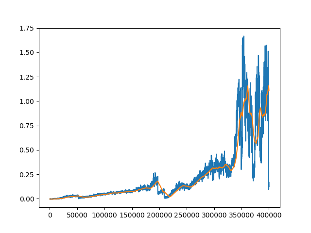

Tennis Project Report
=====================

This report describes my solution to the tennis environment provided by Udacity.  See the file README.md for a description of the environment.

Learning Algorithm
------------------

I solved the environment with an implementation of PPO with separate actor and critic networks.  My PPO implementation was modified to accommodate multiple agents in a collaborative or competitive environment using the same technique used by Lowe et al. in MADDPG.  Specifically, each agent has a separate policy network and the training process uses a shared value network as a critic during training.  The shared value network receives all observations and actions from both agents, thus observing a stationary environment.  This value function then stabilizes training for the policy networks, each of which operates in an environment containing another learning agent.  Both policy networks had identical configurations, with a single hidden layer of 400 nodes, relu activation functions, and a normally distributed policy parameterized by its mean and standard deviation.  Actions were transformed with a tanh function before being passed to the unity environment, but the tanh function was not included in the policy networks for numerical stability reasons.  The value network also used relu activation functions and a single hidden layer of 400 nodes.

policy optimizers: Adam, learning rate 2e-4
value optimizer: Adam, learning rate 3e-4
discount rate: .9
lambda for GAE: 0.
episodes per epoch: 100
updates per epoch: 20
epsilon (for clipping): .05
expected minibatch size per update: 750

Plot of Rewards
---------------

The parameters for my final fitted model are stored in the pickle file checkoint.pth.  The following plot shows average reward per episode at each iteration of training.  The x-axis is number of episodes of experience, where each iteration includes 100 episodes.  The plot also shows average reward over the last 100 training iterations.  I ran 4000 iterations of training, which was sufficient to exceed the goal of an average reward of 0.5 over 100 episodes.  In fact, more than twice that was achieved.

Ideas for Future Work
---------------------

Tuning the hyperparameters would likely result in faster learning.  A high initial learning rate that decreases adaptively might give good performance.  Decreasing learning rate as reward increases might also reduce the instability seen near the end of training.  As training went on and the agents got better at tennis, the time per episode grew.  A better version of this learning algorithm would adaptively reduce the number of episodes per iteration as episode length increased.  Additionally, I would like to experiment with different network architectures, possibly with shared parameters.

